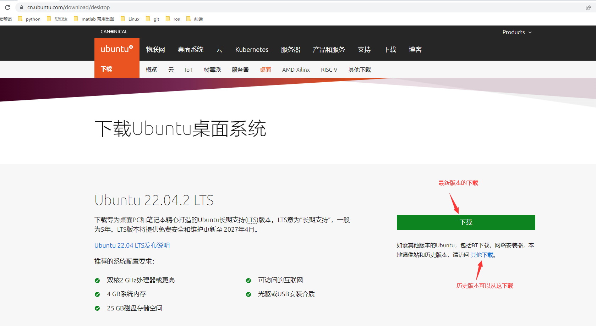
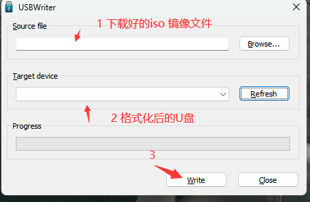
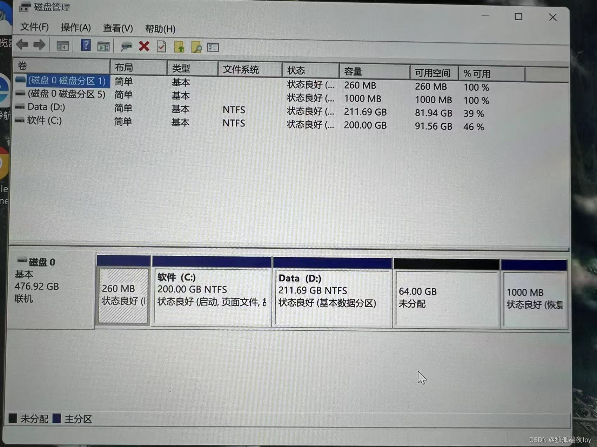
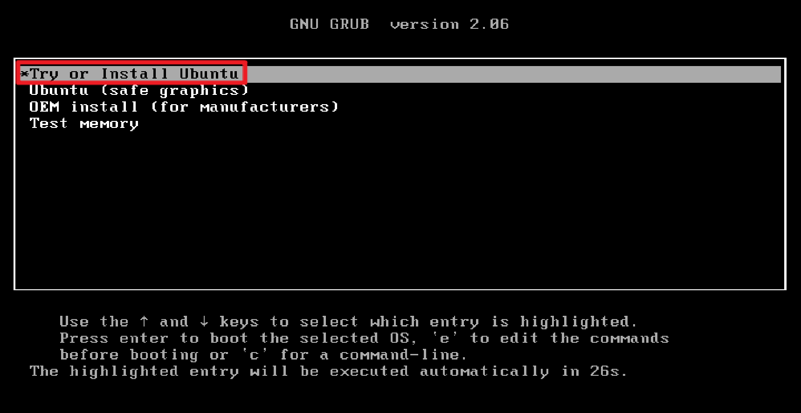
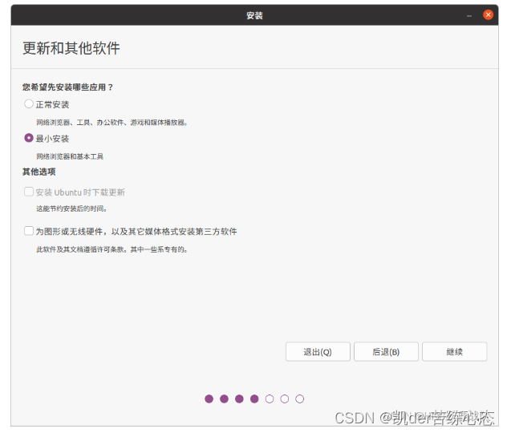
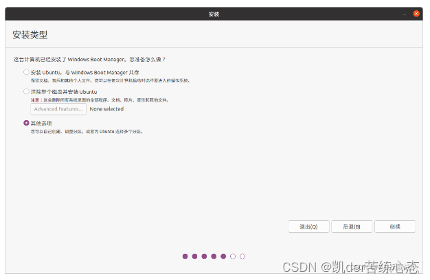
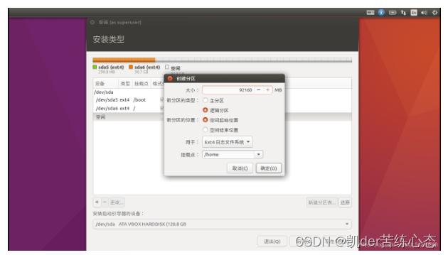
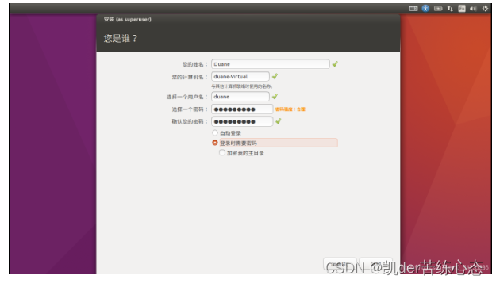
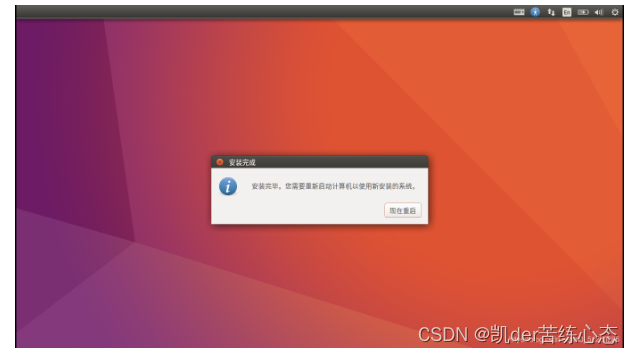

#       		Ubuntu(20.04)     系统的安装								

## 双系统：

​				windows server 2019

​				Ubuntu 20.04

​		

### 一.Ubuntu 系统的安装。

#### 1.1 下载镜像iso文件。

​	地址：https://cn.ubuntu.com/download/desktop



#### 1.2 下载usbwriter 将镜像文件写入到U盘（大于8G）中。

​	地址：https://sourceforge.net/projects/usbwriter/	



#### 1.3 开始安装 

##### 1.3.1 现在在需要安装ubuntu 的电脑上压缩出一个较大的空闲分区。



##### 1.3.2 重启电脑，进入Bios（不同电脑进入的方式不同，一般是F12），选择U盘启动。



##### 1.3.3 进入图形界面进行安装。

a.点击Install Ubuntu。语言和键盘布局根据自己习惯选择。**安装的过程中不要连接网络**

b.更新和其他软件。

​		注意：如果自己的空间比较小可以选择最小安装，**但一般都是选择正常安装，其他的不选择。**



c.安装类型。

**如果是只装ubuntu 可以直接选择清除整个磁盘并安装ubuntu.**

**但我们这里安装的是双系统，必须选择其他选项。**




d. 分区详情。

这里需要注意三点：

**（1）每次创建分区的时候，必须要选择之间压缩的空闲分区。**

**（2）一般的分区方案：**

​					**引导分区  ：** 

​					**交换分区：**

​					**/**

​					**/home**

**(3) 安装启动引导的设备要和引导分区的设备名对应。（不然后面重启的时候会直接进入windows）**



检查分区，无误之后，点击继续。

e. 设置用户名。(如果ubuntu 需要放重要的文件，就勾选登录时需要密码)



f.安装成功之后，点击重启，**拔出u盘**。



重启之后接下来需要做两件事。（**本地安装的时候没有一下两件事操作**）：

1.更换源，如果不换下软件就会很卡 。

1.1首先我们需要先备份Ubuntu官方的软件源，执行以下命令将备份原来的软件源。

```shell
sudo mv /etc/apt/sources.list /etc/apt/sources.list.bak
```

### 二.清华大学镜像

清华大学开源软件镜像站，致力于为国内和校内用户提供高质量的开源软件镜像、Linux镜像源服务。

帮助用户更方便地获取开源软件。镜像站由清华大学TUNA协会负责运行维护。

复制以下命令即可一键切换到清华大学ubuntu 22.04镜像：

```shell
sudo bash -c "cat << EOF > /etc/apt/sources.list && apt update 
deb https://mirrors.tuna.tsinghua.edu.cn/ubuntu/ jammy main restricted universe multiverse
# deb-src https://mirrors.tuna.tsinghua.edu.cn/ubuntu/ jammy main restricted universe multiverse
deb https://mirrors.tuna.tsinghua.edu.cn/ubuntu/ jammy-updates main restricted universe multiverse
# deb-src https://mirrors.tuna.tsinghua.edu.cn/ubuntu/ jammy-updates main restricted universe multiverse
deb https://mirrors.tuna.tsinghua.edu.cn/ubuntu/ jammy-backports main restricted universe multiverse
# deb-src https://mirrors.tuna.tsinghua.edu.cn/ubuntu/ jammy-backports main restricted universe multiverse
deb https://mirrors.tuna.tsinghua.edu.cn/ubuntu/ jammy-security main restricted universe multiverse
# deb-src https://mirrors.tuna.tsinghua.edu.cn/ubuntu/ jammy-security main restricted universe multiverse
EOF"
```


2.装搜狗输入法，默认的中文输入法太拉胯，没法干活，可参考另一篇的教程：

https://blog.csdn.net/qq_42365082/article/details/127046773?csdn_share_tail=%7B%22type%22%3A%22blog%22%2C%22rType%22%3A%22article%22%2C%22rId%22%3A%22127046773%22%2C%22source%22%3A%22qq_42365082%22%7D


#### 1.4  卸载双系统中的Ubuntu：

https://blog.csdn.net/qq_42257666/article/details/120721561

#### 1.5 安装过程中出现的问题。

​	1.5.1 	安装好之后，重启登录界面有可能出现花屏。

​				a.在花屏界面按  ctrl + Alt + (F1-F6)  进入黑小窗口，输入用户名和密码进行登录。

​				b.修改root用户的密码 sudo passwd root    （Ubuntu中root 密码是一个随机密码），切换到root

​				c.修改grub文件

			sudo gedit /etc/default/grub
			
			修改grub配置文件
			将GRUB_CMDLINE_LINUX_DEFAULT="quiet splash"改为GRUB_CMDLINE_LINUX_DEFAULT=“quiet splash nomodeset”
			更新grub
			sudo update-grub

​				d.进行重启。

